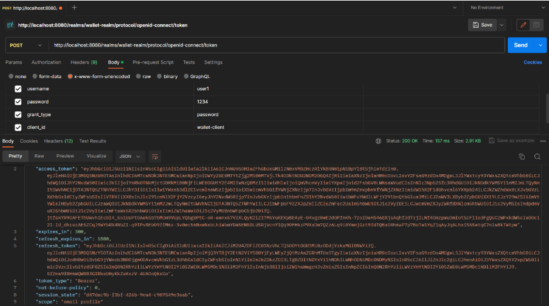
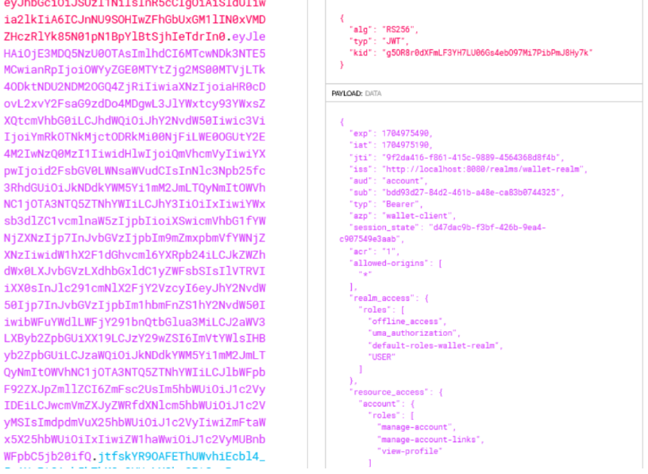
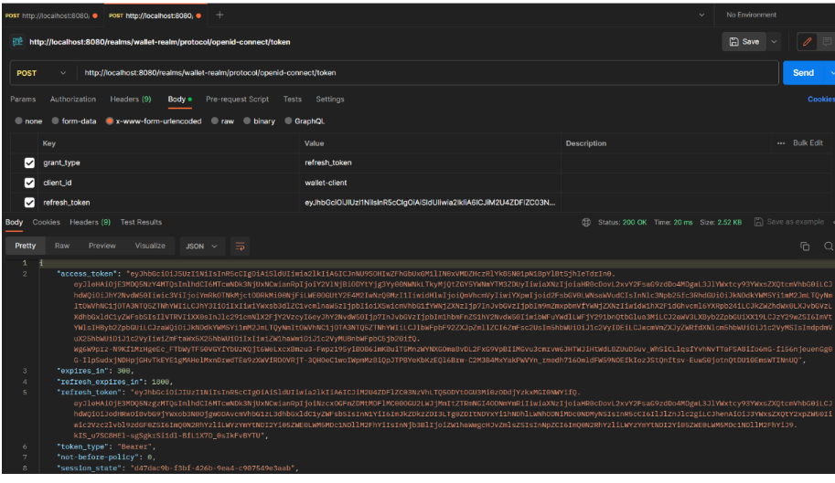
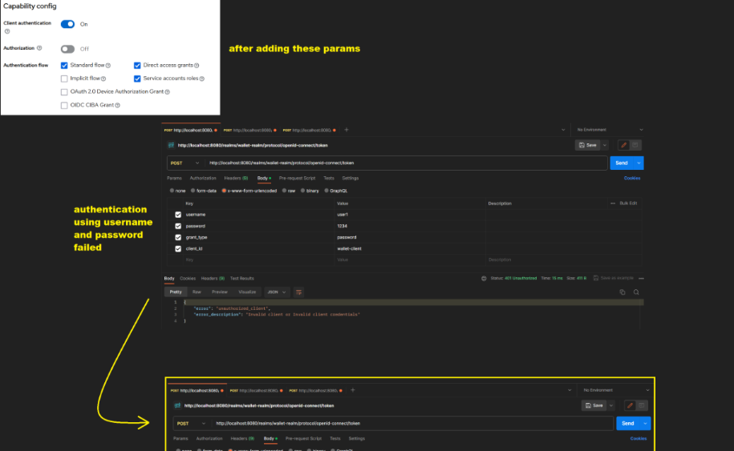
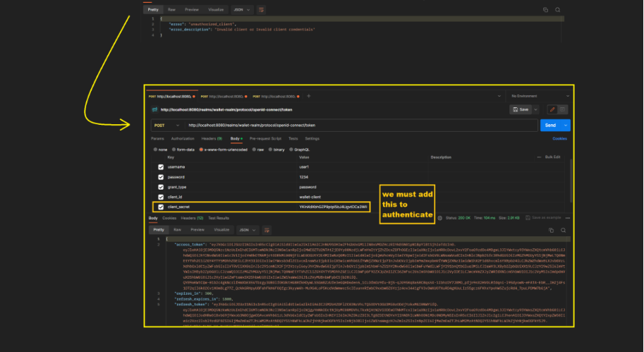
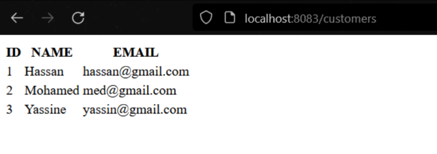
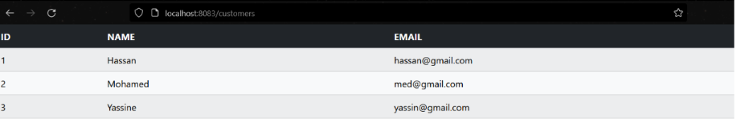
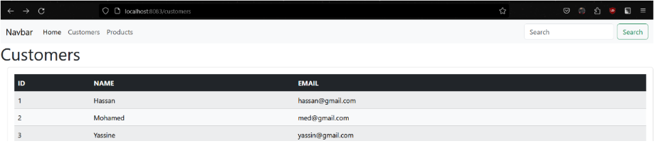

# Security Oauth2, OIDC, JWT, Keycloak , SpringBoot

# Part 1: Keycloak, Jwt 

## Bullet Points :
### in this part we will cover the following topics:

- Download Keycloak 23
- Start Keycloak
- Create an Admin account
- Create a Realm
- Create a client to secure
- Create users
- Create roles
- Assign roles to users
- Using Postman:
    - Test authentication with the password
    - Analyze the contents of both JWT Access Token and Refresh Token
    - Test authentication with the Refresh Token
    - Test authentication with Client ID and Client Secret
    - Change the parameters of Access Token and Refresh Token

### Screenshots :

#### 1. In the following screenshot, i authenticated with the username and password and we got the Access Token and Refresh Token:

#### 2. In the following screenshot, i decoded the Access Token and we can see its content using jwt.io:

#### 3. In the following screenshot, i authenticated with the Refresh Token and we got the new Access Token and Refresh Token:

#### 4. In the following screenshot, i authenticated with the Client ID and Client Secret and we got the Access Token and Refresh Token:

#### 5. In the following screenshot, i changed the capabilitie configuration in keycloak and now even with the client username and password we can't get the Access Token and Refresh Token so we need to use the Client secret and Client ID to get the Access Token and Refresh Token:

# Part 2: SpringBoot, Keycloak, Jwt , Oauth2 

## Bullet Points :

-   Develop and secure a microservices-based application using OAuth 2, OIDC, and Keycloak:
    - Inventory service
    - Frontend Thymeleaf
    - Frontend Angular

### Screenshots :

#### 1. In the following screenshot, i consulted the customer service and i get the list of customers:

#### 2. In the following screenshot, i added the webjar dependency to the pom.xml file so i can use bootstrap and jquery in my project:

#### 3. In the following screenshot, i added the template dependency to the pom.xml file so i can use thymeleaf template in my project that contains the navbar and the footer:

